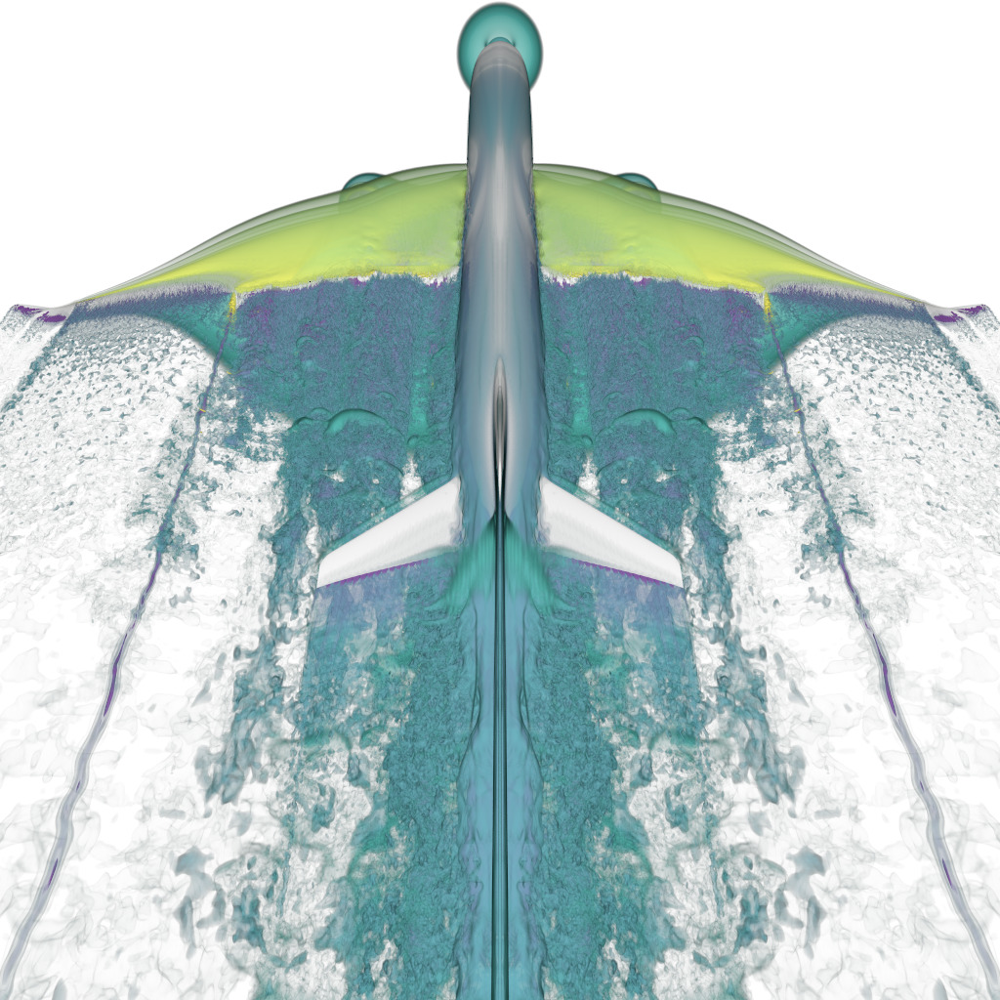
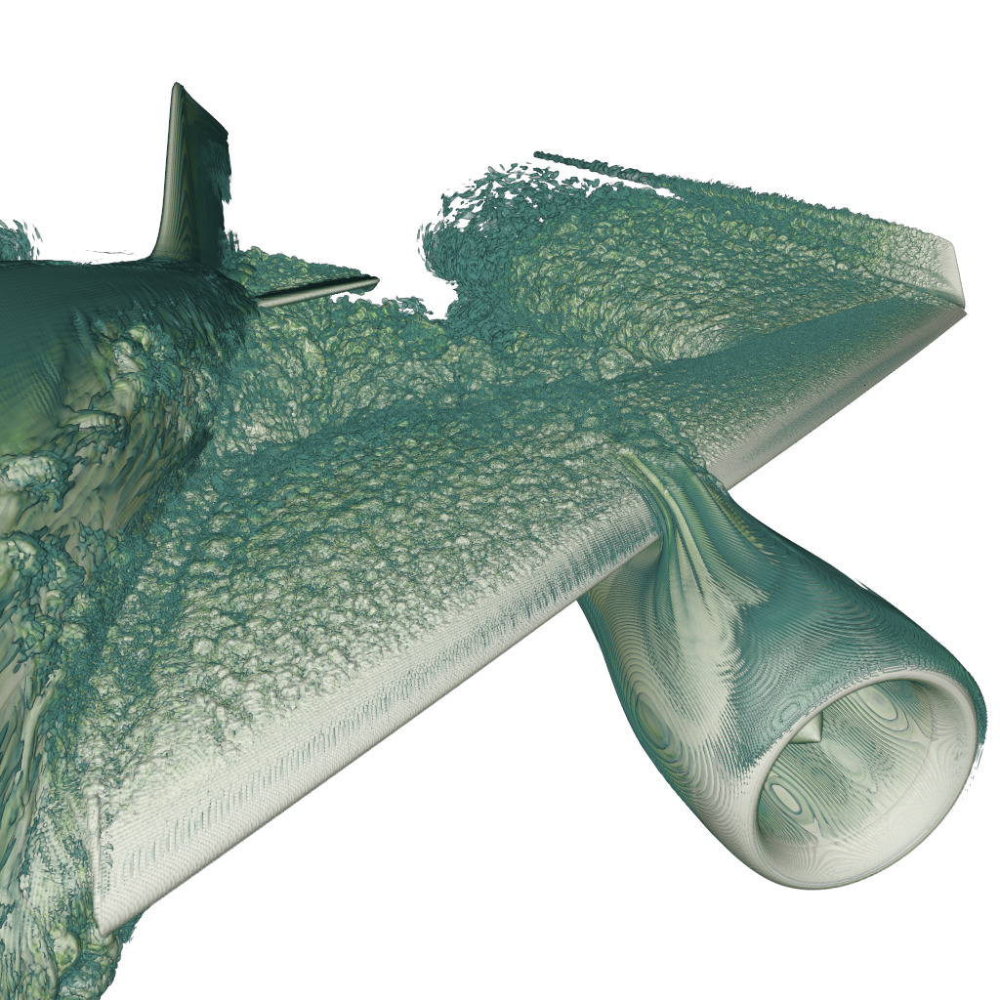
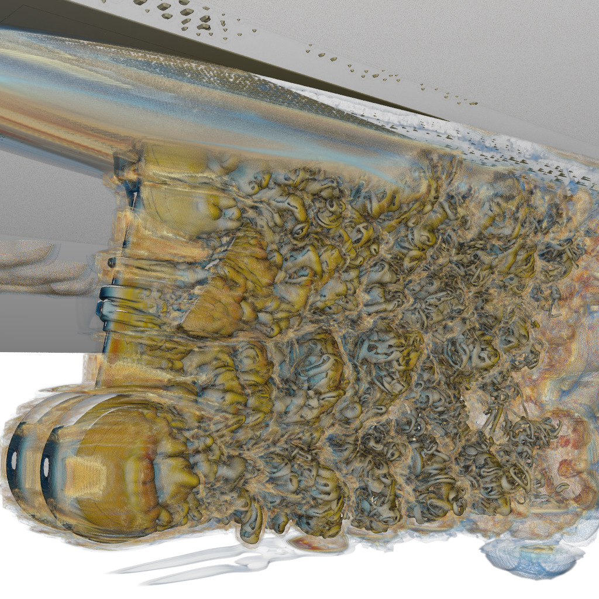
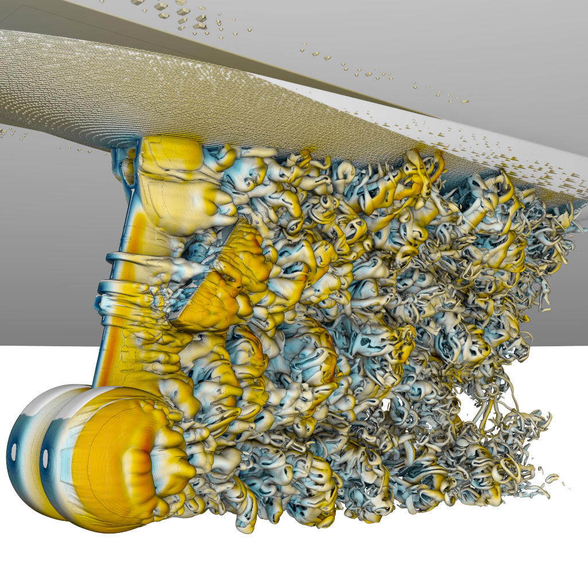
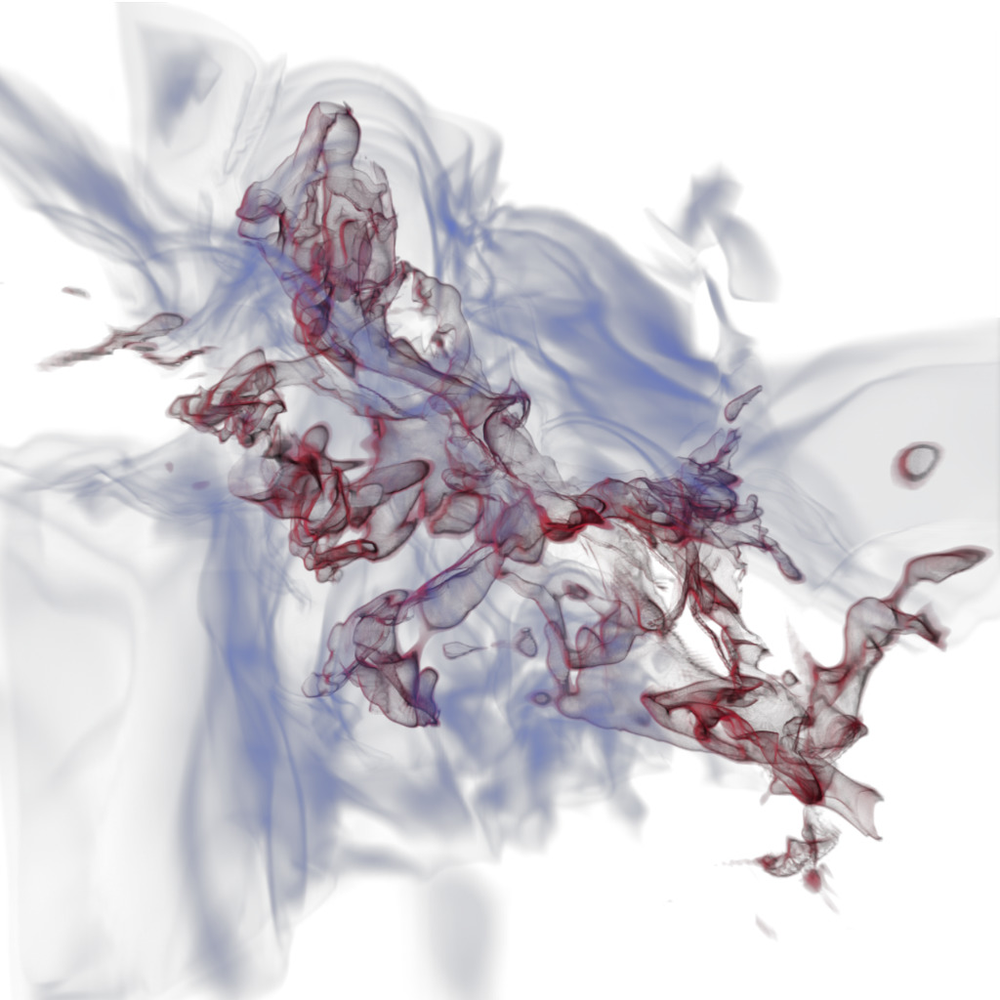
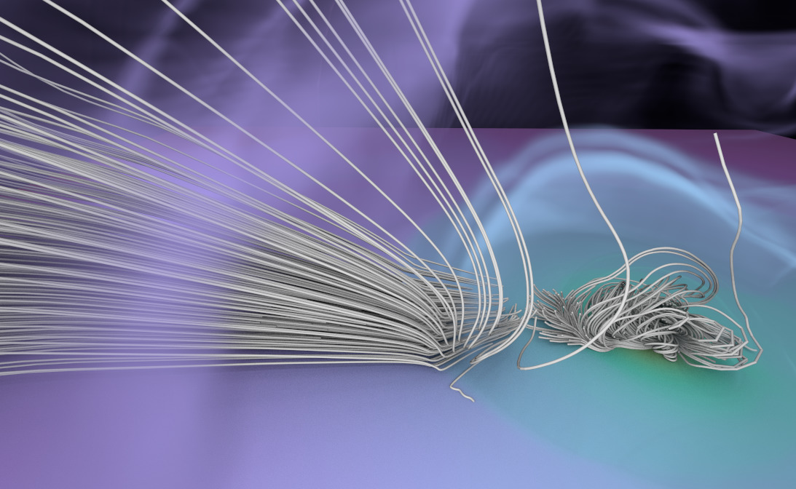
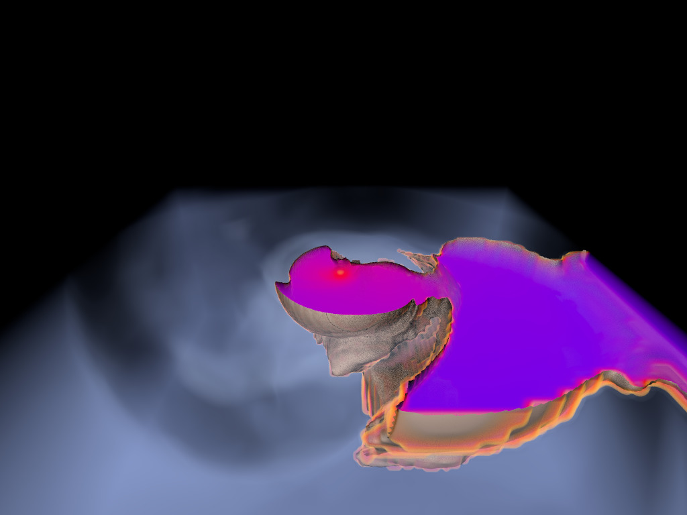

ExaBrick - Tools and Viewer for Structured AMR Data using "Exa Bricks"
======================================================================


# Overview

The core idea of "exabricks" is to re-arrange a structured AMR model
(that can initially be in Exajet, Chombo, Pforest, etc format) into a
sequence of "bricks", where each brick is a regular structured volume
(or arbitrary grid dimensions) and fixed cell resolution. Different
bricks may not overlap, but may have holes between them; each brick's
resolution (i.e., cell width) is always a power of two of a given base
cell size, which is the cell size of the *finest* level. Thus, level 0
is the finest level, level 1 has cells twice as large, etc. Note that
level 0 does not need to exist; it is perfectly valid to start with,
say, level 3.

# Citation

This source code repository accompanies our research paper:

I. Wald, S. Zellmann, W. Usher, N. Morrical, U. Lang, V. Pascussi,
"Ray Tracing Structured AMR Data Using ExaBricks",
IEEE Visualization 2020, SciVis Papers.

Official link: https://ieeexplore.ieee.org/document/9222372

Authors' version / preprint: https://arxiv.org/abs/2009.03076

Cite this work as:

```
@ARTICLE{wald:2020,
  author={I. {Wald} and S. {Zellmann} and W. {Usher} and N. {Morrical} and U. {Lang} and V. {Pascucci}},
  journal={IEEE Transactions on Visualization and Computer Graphics},
  title={Ray Tracing Structured {AMR} Data Using {ExaBricks}},
  year={2020},
  volume={},
  number={},
  pages={1-1},
  doi={10.1109/TVCG.2020.3030470}}
```
# Example Visualizations

Pictures
--------

The following visualizations were created with the exabrick viewer and
demonstrate features such direct volume rendering, implicit isosurface
rendering, or particle tracing with streamlines.

<table><tr><td>
</td><td>
</td><td>
</td></tr><tr><td>
</td><td colspan="2">
</td></tr><tr><td>
</td><td colspan="2">
</td></tr><tr><td>
</td><td colspan="2">
</td></tr></table>

**Acknowledgments**

The exajet data set (first row) is courtesy of Pat Moran of NASA; the landing
gear data set (second row) was graciously provided by Michael Barad, Cetin
Kiris and Pat Moran of NASA. The molecular cloud data set (third row) is
courtesy of Daniel Seifried who is with the theoretical astrophysics group of
the University of Cologne. The binary neutron star data set (fourth row) is
courtesy Jamie Law-Smith and Enrico Ramirez-Ruiz of the Dept. of Astronomy &
Astrophysics, University of California Santa Cruz (UCSC).

# Data we can Handle:

- ExaJet: comes as a list of N cells and N scalar values, with each
  cell specified through four ints { x,y,z,l }, where { x,y,z } are
  the lower left positoin of that cell, and l is the level (in the
  same way that levels are ahdnled in exagrid, hence our name). ExaJet
  is our most general "base" input format that we then convert other
  stuff to, and from which our "exaBuilder" tool can build our exa
  bricks.

- Structured Grids: the tools/ dir contains a tool that takes a
  structured volume and converts it to exajet format, from which we
  can then build exabricks

- Chombo: chombo format already has little bricks, but a) many small
  ones, and b) overlapping ones. There is a hacked version of ospray's
  Chombo importer that, after the OSPRay AMR kd-tree is built,
  iterates over the leaves and emits exajet format cells.

- sciviscontest 2018 / lanl deep water: This is a *un*structured VTU
  data set, but internally actually encodes all structured AMR data
  (ie, though technically double-precision arbitrary vertices, the
  vertices all "happen" to be on integer(-multiple) coordinates. I
  include a tool that converts those to Exajet format, from which
  ..... you get the point.

- FLASH: the format is similar to chombo; FLASH is a commonly used
  astrophysics simulation code that outputs blockstructured AMR
  data.


# Running

Running consists of two steps: Building the input data format, and
then running the viewer.

- Initially, we have to build a ".exa.bricks" file that contains the main
  exabricks data structure; i.e., the bricks themselves, and, for each cell,
  the *ID* of the scalar field cell in the scalars file. This is described
  below for several different input formats.

- Then we create a config file connecting the bricks and the scalar fields;
  this is procedure is the same for all input formats and is described in more
  detail under [Create exa File and Run Viewer](#create-exa-file-and-run-viewer).


## Example: Exajet

Exajet is already in "exajet" format, with one file for the cells (hexes.bin), and
one file for each scalar field (e.g, density.bin)

Since we can use the scalar field as is, all we have to do is convert
the list of cells to our brick format:

       ./exaBuilder ~/models/amr/exajet/hexes.bin ~/exa/exajet.exa.bricks

To view the data set, proceed as described under [Create exa File and Run Viewer](#create-exa-file-and-run-viewer) (with BASENAME=~/exa/exajet.exa).


## Example: LANL Deep Water

This one is a bit more complicated since we have to first convert it
to exajet cells format. To do so, go to tools/convertLanlOcean/, build
this project separately (yes, that's NOT part of the main build, to
avoid the VTK dependency), and then run:

      ./convertLanlOcean -o ~/exa/lanl-ocean.exa ~/models/unstructured/lanl-ocean/pv_insitu.../*vtu

This will take all the VTU files listed on the command line (for this
data set, each pv_insitu_* directory is one time step), and generate
_two_ files: a ".exa.scalars" for the scalars, and a ".exa.cells" for
exajet format cells.

From now on, we can use exabuilder to convert the cells to bricks:

       ./exaBuilder ~/exa/lanl-ocean.exa.cells ~/exa/lanl-ocean.exa.bricks

To view the data set, proceed as described under [Create exa File and Run Viewer](#create-exa-file-and-run-viewer) (with BASENAME=~/exa/lanl-ocean.exa).


## Example: FLASH

Start by creating the .exa.cells/.scalars files; therefore, first locate the variable(s) you want to extract:

./exaFlashToCells <FILE> --list

Then export each variable into separate scalar files (redundant .cells files will be generated along with this):

       ./exaFlashToCells <FLASH> --var "var " --o <BASENAME> 

This will create two files BASENAME.cells and BASENAME.scalars

Note that the variable name usually consists of four chars, i.e., fewer than four letters are usually padded w/ spaces!

Then, generate the bricks:

    ./exaBuilder <BASENAME>.cells -o <BASENAME>.bricks

To view the data set, proceed as described under [Create exa File and Run Viewer](#create-exa-file-and-run-viewer).

## Example: LLNL

Convert .raw file to exa format, using a threshold to generate
larger-than-one size blocks. E.g.,

    mm && ./exaRawToCells 2048 2048 1920 byte /mnt/nas/wald_nas/models/dvr/llnl_0250.raw /space/exa/llnl/llnl-threshold1-level4 1 4
	
will generate up to level-4 (ie, 16^3-sized) cells with a min/max
value threshold of <= 1.f.

Then build bricks

    ./exaBuilder /space/exa/llnl/llnl-threshold1-level4.cells -o /space/exa/llnl/llnl-threshold1-level4.brick

To view the data set, proceed as described under [Create exa File and Run Viewer](#create-exa-file-and-run-viewer) (with BASENAME=/space/exa/llnl/llnl-threshold1-level4).

## Create exa File and Run Viewer

Once you have the bricks, create a exa config file (e.g., BASENAME.exa) that specifies both bricks and scalar you want to render

    #<BASENAME>.exa config file
    scalar density <BASENAME>.scalars
    # for density, only look at 1.17 to 1.21 region:
    value_range 1.17 1.21
    bricks <BASENAME>.bricks

Once you got that, run the viewer

    ./exaViewer <BASENAME>.exa
   

# Dependencies

The project depends on the following third-party libraries that are either packaged under [submodules](/submodules) or should be installed by the user:

- [CMake][1]
- [OpenGL][12]
- [NVIDIA CUDA Toolkit][4]
- [Optix 7](https://developer.nvidia.com/designworks/optix/download)
- [GLUT][5] or [FreeGLUT][6]
- [HDF5](https://www.hdfgroup.org/solutions/hdf5/) for FLASH converter, optional

Submodules / included in this project:
- [OWL](https://github.com/owl-project/owl) wrappers library on top of OptiX 7
- [stb](https://github.com/nothings/stb) for image handling
- [GLUI](https://github.com/ingowald/glui) (we use a fork of that library with some extensions; find the original version under https://github.com/libglui/glui)
- [Cmdline](https://github.com/abolz/Cmdline2)

# Contributors

Ingo Wald (NVIDIA), Stefan Zellmann (University of Cologne), Will Usher (SCI Institute, University of Utah), Nate Morrical (SCI Institute, University of Utah)

# License

This project is licensed under the Apache 2.0 License. See the LICENSE file for details.


[1]:    http://www.cmake.org/download/
[4]:    https://developer.nvidia.com/cuda-toolkit
[5]:    https://www.opengl.org/resources/libraries/glut/
[6]:    http://freeglut.sourceforge.net/index.php#download
[12]:   https://www.opengl.org
